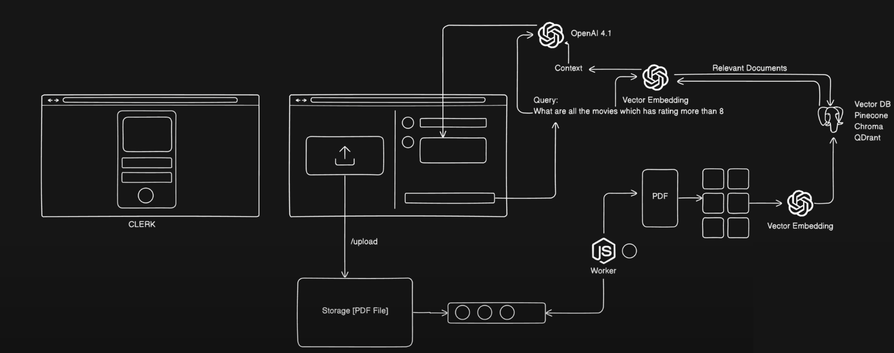

# AI-Powered PDF Chatbot

## Overview

This project implements a full-stack AI-powered chatbot that allows users to upload PDF documents and engage in a question-answering conversation based on the content of those documents. It leverages modern web technologies, a robust queuing system for document processing, and advanced AI models for semantic search and conversational responses.

## System Design

Here's a high-level overview of the system architecture:


*Replace this placeholder with an actual diagram of your system. You can create one using tools like Draw.io, Lucidchart, Excalidraw, or even simple block diagrams.*

**Key Components:**
* **Frontend (Next.js):** User interface for uploading PDFs and interacting with the chatbot.
* **Backend (Express.js):** Handles API requests, manages file uploads, and orchestrates interactions with the queue and AI services.
* **Queue (BullMQ on Redis):** Asynchronously processes PDF uploads to avoid blocking the main application thread.
* **Worker (Node.js):** Consumes jobs from the queue, loads and chunks PDFs, generates embeddings, and stores them in the vector database.
* **Vector Database (Qdrant):** Stores vector embeddings of PDF chunks for efficient semantic search.
* **Embedding Model (OpenAI Embeddings):** Converts text chunks into numerical vectors.
* **LLM (OpenAI GPT-4o/GPT-3.5 Turbo):** Generates conversational responses based on retrieved document context.
* **Authentication (Clerk):** Manages user authentication.

## Features

* **PDF Upload:** Securely upload PDF documents.
* **Asynchronous Processing:** Documents are processed in the background using a message queue.
* **Contextual Chat:** Ask questions and get answers directly from the content of your uploaded PDFs.
* **RAG (Retrieval Augmented Generation):** Leverages semantic search to retrieve relevant document chunks before generating a response.
* **Scalable Architecture:** Designed with separate services for better scalability and maintainability.

## Technologies Used

**Frontend:**
* **Next.js:** React framework for building user interfaces.
* **TypeScript:** Type-safe JavaScript.
* **Tailwind CSS:** For styling.
* **Clerk:** User authentication.
* **Sonner:** Toast notifications.

**Backend:**
* **Node.js & Express.js:** Server-side runtime and web framework.
* **BullMQ:** Robust message queue for background jobs (powered by Redis).
* **Multer:** Middleware for handling file uploads.
* **LangChain.js:** Framework for developing applications powered by language models.
* **OpenAI API:** For embeddings (`text-embedding-3-small`) and chat completions (`gpt-4o`).
* **Qdrant:** High-performance vector database.
* **PDFLoader (`@langchain/community/document_loaders/fs/pdf`):** For loading PDF content.
* **CharacterTextSplitter (`@langchain/textsplitters`):** For chunking PDF text.
* **`dotenv`:** For managing environment variables.

## Getting Started

Follow these steps to set up and run the project locally.

### Prerequisites

* Node.js (v18+)
* npm or Yarn
* Docker (recommended for Redis and Qdrant)

### Setup

1.  **Clone the repository:**
    ```bash
    git clone <your-repo-url>
    cd chat-with-pdf
    ```

2.  **Environment Variables:**
    Create a `.env` file in the `server` directory and add your OpenAI API Key:
    ```
    OPENAI_API_KEY=YOUR_OPENAI_API_KEY_HERE
    ```
    *(Replace `YOUR_OPENAI_API_KEY_HERE` with your actual key.)*

3.  **Install Dependencies:**
    * **Backend:**
        ```bash
        cd server
        npm install
        ```
    * **Frontend:**
        ```bash
        cd ../ # Go back to the project root
        npm install
        ```

4.  **Run Docker Containers (Redis and Qdrant):**
    Ensure Docker is running on your machine.
    ```bash
    # Run Redis (for BullMQ)
    docker run -d -p 6379:6379 redis/redis-stack-server:latest

    # Run Qdrant (vector database)
    docker run -d -p 6333:6333 -p 6334:6334 qdrant/qdrant
    ```

### Running the Application

1.  **Start the Backend Server:**
    Open a new terminal and navigate to the `server` directory:
    ```bash
    cd server
    node index.js
    ```

2.  **Start the Worker:**
    Open *another* new terminal and navigate to the `server` directory:
    ```bash
    cd server
    node worker.js
    ```

3.  **Start the Next.js Frontend:**
    Open a *third* new terminal and navigate to the project root directory:
    ```bash
    npm run dev
    ```

Your application should now be running! Open your browser and navigate to `http://localhost:3000` (or whatever port Next.js starts on).

## Usage

1.  **Upload PDF:** On the left side, click "Upload a PDF" and select your document.
2.  **Chat:** Once the PDF is processed (check your worker terminal for confirmation), type your questions in the chat interface on the right and get contextual answers.
